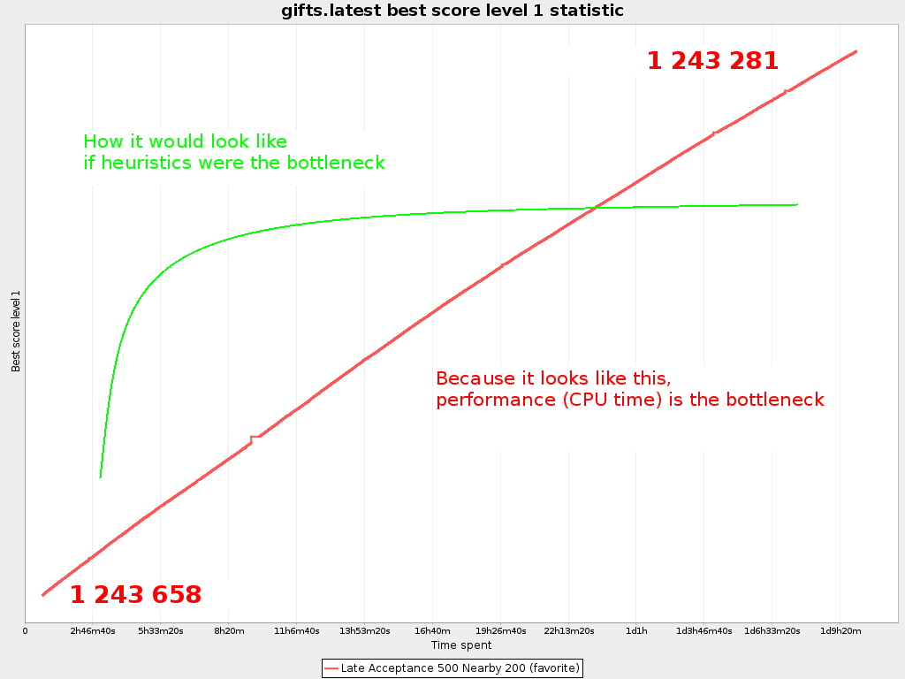

== Introduction

We're solving the kaggle problem.

== How to run our code

* Open the `pom.xml` with IntelliJ or Eclipse

* Run the UI:

** Main class: `org.optaplannerdelirium.sss.app.ReindeerRoutingApp`

** VM options: `-Xmx2G -server`

** Working directory: `santas-stolen-sleigh` (the default)

** Click import button and select a dataset. Highly recommended to select a slice the first time.

* Run the Benchmarker:

** Main class: `org.optaplannerdelirium.sss.app.ReindeerRoutingBenchmarkApp`

** VM options: `-Xmx2G -server` (Add `-Dlogback.level.org.optaplanner=info` to reduce logging verbosity)

** Program arguments (optional): `ge0ffreyLaptop` to run https://github.com/ge0ffrey/santas-stolen-sleigh/blob/master/src/main/resources/org/optaplannerdelirium/sss/benchmark/ge0ffrey/ge0ffreyLaptopBenchmarkConfig.xml[another config than the default]

** Working directory: `santas-stolen-sleigh` (the default)

* Note that starting a Local Search phase on a 100k problem can include up to 1.5 hours with no output due to the nearby selection bootstrap.

== Algorithm description

We didn't have much time to implement this case.
In the first 3 weeks, we worked just a few spare hours to build a simple domain.
Only during the Christmas holidays, we had enough time to implement the solver and start optimizing.

=== Partitioning

Once we started, we quickly realized that even simple strategies (such as 2-opt hill climbing)
would take days to flat-line, so partitioning was vital. We introduced 3 strategies to partition the problem into smaller bits to solver separately:

* Whole of 100k
* 5 chunks of 20k each.
* 20 slices of 5k each.

Each of these types go in their own subdirectory of the import dir.
We don't have easy access to a cluster, so each of us ran it mostly on his laptop/desktop.
Therefore, we started by focusing on the 5 chunks, which ended up neglecting all research with the 20 slices.

We configured our https://github.com/ge0ffrey/santas-stolen-sleigh/blob/master/src/main/resources/org/optaplannerdelirium/sss/benchmark/reindeerRoutingBenchmarkConfig.xml[benchmark config]
to run the 5 chunks in parallel (with only 3 in parallel at the same time on 4 core machine).

Some time before the competition deadline,
we decided to merge the 5 chunks of20k into a single whole 100k solution and focus on optimizing that as a whole
because http://www.optaplanner.org/blog/2014/03/03/CanMapReduceSolvePlanningProblems.html[partitioning lowers solution quality].

=== Construction Heuristics

First we started with http://docs.jboss.org/optaplanner/release/latest/optaplanner-docs/html_single/#firstFitDecreasing[First Fit Decreasing]
and sorted the gifts (= the planning entities) by longitude (with more _difficult_ gifts at the right).
The initial solution created by this Construction Heuristic weren't fantastic.

To improve the initial solution, we added a https://github.com/ge0ffrey/santas-stolen-sleigh/blob/master/src/main/java/org/optaplannerdelirium/sss/solver/custom/BigGiftInitializer.java[BigGiftInitializer],
which is a Construction Heuristic that gives all big gifts (with a weight >= 50) it's own reindeer (and leaves the other gives unassigned).
It's run as a custom phase before the First Fit Decreasing algorithm, so the FFD then assigns the smaller gifts.

=== Local Search

Out of habit, we went with http://docs.jboss.org/optaplanner/release/latest/optaplanner-docs/html_single/#lateAcceptance[Late Acceptance]
as it's very easy to configure, with late acceptance size of `400` at first and `500` later.
We did quickly benchmark Tabu Search on the just initialized solutions (so again in the short run), but LA easily beat it.
This is of course no surprise in hindsight, as it didn't even flat-line after days of computation, the long run wasn't hours but weeks.
So we should really try Tabu Search once LA starts flat-lining...
Furthermore, we never benchmarked Simulated Annealing (even though it's just 1 line change in the config...).

As for moves (= Local Search neighborhood), we went with:

* http://docs.jboss.org/optaplanner/release/latest/optaplanner-docs/html_single/images/Chapter-Move_and_neighborhood_selection/changeMove.png[change moves] (= relocate)

* http://docs.jboss.org/optaplanner/release/latest/optaplanner-docs/html_single/images/Chapter-Move_and_neighborhood_selection/swapMove.png[swap moves] (= swaps)

* tail chain swap moves (= 2-opts)

* Later we also added a limited prototype for 3-opts (no reversing, and currently with a temporarily limitation that at least 2 of the gifts need to be in a different reindeer trip).

Of course, to scale these moves to a 5k VRP, let alone a 100k VRP, we needed to apply http://docs.jboss.org/optaplanner/release/latest/optaplanner-docs/html_single/#nearbySelection[nearby selection].
We originally went with a parabolic nearby distribution of `100`, but recently switched that to `200`.
This means we try connecting a gift to its nearest 100 (or 200) gifts.

=== Performance tricks

On our machines, we can evaluate about 20k moves per second on average in Local Search.
This includes the overhead from Nearby Selection, etc.

The main trick is of course - as it always is - the use of http://docs.jboss.org/optaplanner/release/latest/optaplanner-docs/html_single/#incrementalJavaScoreCalculation[incremental score calculation],
which means that we only calculate the delta of the scores of the before and after solution for each move.

We found the haversine function to be very costly. Caching https://www.kaggle.com/c/santas-stolen-sleigh/forums/t/18049/simpler-faster-haversine-distance[the cartesian coordinates]
already improved performance. Despite that, VisualVM profiling (sampling mode) still showed that the haversine function takes over 75% of performance.
We tried caching the distances between every 2 gifts - and you can still enable that  by adding the VM option `-Dsss.useCachingSphereLocation`,
but it didn't improve performance much and exploded memory usage exponentially.
Loading a chunk in 2GB RAM was already impossible, yet without it we can solve a whole 100k with 2G RAM easily.

We saw that the Nearby Selection bootstrap was very costly because it compares each gift with every other gift to determine the order
- and lacked the time to investigate using a k-d tree - but found out that we could replace the haversine distance
with the squared direct distance to still get the exact same nearby ordering, at a fraction of the time
(still 1.5 hours for 100k gifts though). This heavily reduced the Local Search bootstrap time.

We also tried replacing the haversine distance with the direct distance (squared even) in the score function,
needless to say that was a disaster when evaluated with the correct score function after optimizing.
But damn it was fast!

=== Results

By the end of the holidays, we really started running benchmarks (usually 8 hours night), and started each benchmark on the best results of the previous.
The score kept improving and more importantly, _the best score over time graph_ didn't show any signs of flat-lining yet.
So, with the deadline only a week away, we started running longer benchmarks, switched from chunks to whole
and when the competition ended, we had a score of `12432...`

But, here's the kicker: *still no signs of flat-lining* during our last 36h benchmark just before the competition deadline:

Flat-lining would mean that the end of that red line becomes almost horizontally,
so that the return on invested time (so the score improvement in that time) diminishes a lot as time progresses.
It does _not_ - not even after days of optimizing - so I argue that
*machine power and total CPU time was pretty important this year to make it to the top* (unlike in previous years).
The fact that the winning solution can still be improved by simple moves, seems to agree with this.

We 'll keep running our benchmarks for a few more days, to identify when our LA configuration starts flat-lining.

It was a very interesting and well organized competition
and I look forward to the details of other approaches to this problem,
as well as next year's Santa competition.

== Old stuff

=== Research investigations log

For team members only: Add your name to reserve a topic if you're doing it.
Summarize your findings under the topic's title.
Following the scientific method, others are encouraged to try to reproduce your findings and also report their findings below yours.

==== TS vs LA

Geoffrey:
On a 1 hour run, TS 7 was worse than LA 400 on slice0.
More importantly: TS flatlined and LA didn't flatline yet.

https://dl.dropboxusercontent.com/u/28857538/2015-12-24_102218_aggregation/index.html[Slice 2 benchmark]

==== Play with Tabu Search ratio's

Lukas:
Results here: https://drive.google.com/file/d/0B2Qb5W2kA2huVnY1eEtYZ2JvVUk/view?usp=sharing
Some conclusions:
* Performance on all slices very similar. Future benchmarks will only be done on one of the slices to save time.
* Very small (~ 1 %) tabu ratios are better than tabu size 7.
* In the long run, LA still most likely better.

==== Investigate combinations of TS and LA

Done. Results here: https://drive.google.com/file/d/0B2Qb5W2kA2huWG1PUHU3enB4djA/view?usp=sharing
To explain: this is two solvers run on the same slice, first TS, then LA. "REVERSE" results are LA first, TS second. All benchmarks have various settings to compare various nearby sizes, tabu ratios etc.

==== Play with less/more partitions

TODO

==== Play with TS parameters

TODO

==== Play with LA parameters

Ondrej:
https://drive.google.com/folderview?id=0B1PRlutaQSliT3N6RlpPS25LcEU&usp=sharing
Played with some parameters, the results seem quite interesting to me.
Please report any observations/conclusions you make so I can investigate further.

==== Play with nearby selection parameters

https://drive.google.com/file/d/0B2Qb5W2kA2huN01GN3AzNjU4VG8/view?usp=sharing
There is a lot to say about this. I'll leave everyone to draw their own conclusions for now.

==== New nearby meter alternative that ignores latitude

All gifts need to return to the north pole anyway.

Geoffrey:
In itself, it's worse than the normal meter

https://dl.dropboxusercontent.com/u/28857538/benchmarks/sss/2015-12-24_163751_aggregation_longitudeMeter/index.html[benchmark result]

==== Use subchain moves

Near the end, once we're getting stuck, we should definitely start using course-grained moves.

TODO

==== 3-opt

Limited implementation done. No reversing, no 3 opts with arcs that all belong to the same chain.

==== K-opt

TODO

==== Ruin & recreate

TODO
